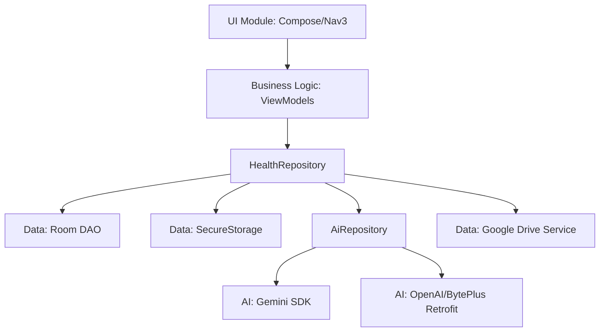

# SanoAI System Design Document

This document provides a high-level overview of the SanoAI application architecture, module responsibilities, and data flows.

## 1. System Architecture

SanoAI follows the **MVVM (Model-View-ViewModel)** architecture combined with a **Repository Pattern**. This ensures a clean separation of concerns, making the app maintainable, testable, and robust.

-   **View Layer (Jetpack Compose)**: Observes UI State from ViewModels and renders the interface.
-   **ViewModel Layer**: Manages UI state, handles user interactions, and communicates with the Repository.
-   **Repository Layer**: Acts as the single source of truth, orchestrating data between local persistence and AI services.
-   **Data Layer**: Handles Room database operations, secure storage, and network requests.

---

## 2. Core Modules

### 🎨 UI Module
-   **Navigation 3**: Implements a modern, state-driven navigation architecture using `androidx.navigation3`.
-   **Screens**:
    -   **Dashboard**: High-level overview with AI suggestions and health metrics.
    -   **Food/Exercise Log**: AI-powered data entry with CameraX integration.
    -   **AI Chat**: Conversational interface for personalized health advice.
    -   **Settings**: Secure configuration for API keys and user profile.
-   **VitaMind Design System**: A custom organic aesthetic featuring warm pastel colors (Beige, Mint, Coral) and hand-drawn shapes (`OrganicBlobShape`, `SpeechBubbleShape`).

### 🧠 Business Logic Module
-   **HealthViewModel**: Manages the core health state, including logs, profile updates, and cached daily suggestions.
-   **ChatViewModel**: Manages the conversational state and history for the AI Health Consultant.
-   **AiRepository**: High-level AI coordinator. Handles prompt engineering, provider selection, and robust JSON parsing of AI responses.
-   **HealthRepository**: Primary data hub coordinating between `HealthDao`, `AiRepository`, and `SecureStorage`.

### 💾 Data Module
-   **Room Database**: Persists `FoodLog`, `ExerciseLog`, `UserProfile`, `WeightRecord`, and `DailySuggestion` (v2).
-   **SecureStorage**: Uses `EncryptedSharedPreferences` to manage sensitive API keys for Gemini, OpenAI, and BytePlus.
-   **Google Drive Backup**: A service that facilitates database file (`sanoai_db`) backup and restore to the user's private app data folder in the cloud.

### 🤖 AI Module
-   **Google Gemini SDK**: Native integration for high-performance vision and text tasks (e.g., `gemini-3.5-flash`).
-   **OpenAI/BytePlus (Retrofit)**: A flexible API client supporting the OpenAI-compatible protocol for models like `gpt-5.4-mini`.

---

## 3. Module Relationships & Interaction

---

## 4. Key Data Flows

### 📸 Smart Logging Flow (Food)
1.  **Capture**: User takes a photo using CameraX in `FoodLogScreen`.
2.  **Analyze**: Image is passed to `AiRepository.analyzeFood()`.
3.  **Extraction**: AI returns structured JSON; `Moshi` parses it into a `FoodAnalysisResponse`.
4.  **Verification**: Results auto-populate the form; the user can manually override.
5.  **Persist**: On save, `HealthRepository` inserts a `FoodLog` entity into Room.

### 💬 Contextual Chat Flow
1.  **Request**: User sends a question in `ChatScreen`.
2.  **Context Injection**: `ChatViewModel` fetches the user's profile and latest logs from the database.
3.  **Prompt**: `AiRepository` constructs a system prompt containing the user's data + conversation history.
4.  **Inference**: The AI provider generates a personalized health response.
5.  **Update**: The UI state is updated with the AI message, and the user continues the conversation.

---

## 5. Security & Privacy

-   **API Key Management**: API keys are entered via a masked `PasswordVisualTransformation` field and stored using hardware-backed encryption (`AES256_GCM`).
-   **Local-First Approach**: All health metrics and logs remain on-device in the Room database unless the user explicitly triggers a cloud backup.
-   **Secure Backup**: Google Drive backups are stored in a restricted "App Data" folder, inaccessible to other apps or the user's general Drive view.
-   **Logging**: Sensitive data (keys, personal logs) is strictly excluded from `Logcat` and error traces.
